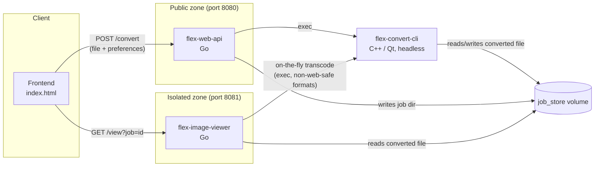

# Architecture

This document describes the system design for FLEX_QURL — the web-facing evolution of the [FLEX](https://github.com/Cub1cMang0/FLEX) file converter (specifically the image conversion), protected by [qURL](https://layerv.ai) (LayerV's zero-trust access product, built on the OpenNHP protocol).

## 1. System Context

FLEX_QURL changes the original desktop FLEX application into multiple independently deployable services along with a shared storage layer. These changes were performed primarily because of the different purposes of these programs. The original desktop FLEX application is geared towards a program installed on the user's local computer while FELX_QURL is a web-based file converter currently supporting the same image extensions as the desktop FLEX. Due to these differences the following modules were made:

| Component | Language | Role |
|---|---|---|
| **Frontend** (`flex-webapi/static/index.html`) | HTML/JS | UI for uploading a file and selecting an output extension, configuring conversion preferences, and downloading the output along with being able to preview the converted output. |
| **flex-web-api** | Go | The public entry point that accepts user uploads, generates a job ID, shells out to the CLI to perform the image conversion, and persists results to the job store directory. |
| **flex-image-viewer** | Go | The isolated image-viewing microservice that reads finished jobs from the shared job store directory and renders them, transcoding on the fly when needed in order to display image extensions that can't be natively displayed on the web. |
| **flex-convert-cli** | C++ (Qt, headless) | The thin conversion engine CLI wrapper around FLEX's existing `MainImageConverter` class, run with the `offscreen` QPA platform since Qt is a GUI-central framework. |
| **job_store** (volume) | — | A directory shared between `flex-web-api` and `flex-image-viewer`, keyed by job ID, that allows for the two services communicate asynchronously without an actual database. |

Both Go services currently ship in a single container (see §4), started together by `start.sh` (constructed during Dockerfile building); they are architecturally separate services sharing a filesystem and not a single monolith.

## 2. Sequence: Data Flow

Steps as currently implemented in `flex-webapi/main.go` and `flex-image-viewer/main.go`:

1. The user submits an image file and a JSON `preferences` form field to `flex-web-api` via `POST /convert?to=<ext>`.
2. `flex-web-api` generates a job ID (`job-<unix-nanoseconds>`), creates `job_store/<job-id>/`, and writes the uploaded file there.
3. `flex-web-api` shells out to `flex-convert-cli <input> <workDir> <ext> <preferencesJSON>` with a 30-second timeout (`context.WithTimeout`), so a hung conversion fails the request instead of hanging indefinitely.
4. `flex-convert-cli` runs the conversion via FLEX's unmodified `MainImageConverter`, writing the converted output into the same job directory.
5. `flex-web-api` deletes the raw input file from the job directory and returns `{"status": "success", "job_id": "..."}` as JSON.
6. The user (or frontend) navigates to `flex-image-viewer`'s `GET /view?job=<job-id>`, which returns a minimal HTML shell pointing an `` tag at `GET /raw?job=<job-id>`.
7. `flex-image-viewer` scans the job directory for the converted file (skipping `.json` prefs). If the format is browser-safe (`png, jpg, jpeg, bmp, ico, jfif`), it gets served directly; otherwise the viewer needs to shells out to `flex-convert-cli` to transcode it to PNG on the fly, caching the transcoded file for subsequent requests.

## 3. Architectural Decision Records (ADR)

### ADR 1: Microservice separation: Viewer as a standalone service, not a `/view` route available on the API

**Decision:** `flex-image-viewer` is a standalone Go binary on its own port (8081) rather than an additional endpoint on `flex-web-api` (8080).

**Rationale:**
- **Security isolation.** The viewer only ever *reads* from `job_store` and shells out to the CLI for read-only transcoding. It never accepts uploads or writes new jobs. Keeping it as a separate process means a compromise of the (higher-traffic, user-facing-upload) API surface doesn't automatically grant write access to the viewer, and vice versa.
- **Independent qURL protection.** The two services have different trust requirements; the API needs to accept public uploads, while the viewer serves converted output that should be gated per-job. Splitting these services lets each sit behind its own qURL Connector sidecar with a policy scoped to what that service actually does, rather than one blanket policy covering both upload and view traffic.
- **Independent scaling and failure domains.** Transcoding-on-view is CPU-bound and bursty; keeping it out of the upload path means a spike in viewer traffic can't starve `/convert` requests.

**Trade-off accepted:** two processes to deploy and monitor instead of one, and both currently need `job_store` and `flex-convert-cli` in their working directory.

### ADR 2: Shared disk volume (`job_store`) VS. a dedicated database

**Decision:** Converted jobs are written to and read from a plain directory (`./job_store/<job-id>/`) rather than persisted as blobs in PostgreSQL or a similar database .

**Rationale:**
- **The data is a file, not a row.** Image bytes are exactly what a filesystem is built to serve efficiently (`http.ServeFile`). Storing them in a database would mean an extra serialize/deserialize step to get back to a servable file, with no real benefit for this access pattern.
- **No query needs.** The only lookup is "give me the contents of job `<id>`," which a directory keyed by job ID already answers in O(1). This means that there's no need for indexes, joins, or a query language in order to fetch files.
- **Simplicity for a synchronous, short-lived workflow.** Jobs are produced and consumed in a single request/response cycle (or shortly thereafter). A database adds an operational dependency (connection pooling, migrations, backups) that this workflow doesn't need.
- **Natural fit for the shared-store communication pattern.** The API and Viewer being separate services need *some* shared state to pass a completed job between them. So a mounted volume is the simplest thing that works for two co-located containers, and generalizes cleanly to a qURL Connector sidecar sitting in front of the same volume.

**Trade-off accepted:** no built-in TTL/expiry, no multi-host durability, and cleanup of stale jobs currently has to be handled separately (planned: a TTL sweep). This won't scale past a single host without moving to shared network storage or object storage.

### ADR-3: On-the-fly transcoding vs. always generating both formats upfront

**Decision:** When a converted file isn't browser-safe (e.g., `.cur`, `.pbm`, `.xbm`), `flex-image-viewer` transcodes it to a temporary PNG lazily, on the first view request, rather than having `flex-convert-cli` always produce both the user's requested format *and* a PNG preview at conversion time.

**Rationale:**
- **Most conversions are never viewed in-browser.** A file converted to `.ico` for download doesn't need a PNG preview generated unless someone actually opens the viewer link; generating it unconditionally would waste CPU and job-store space on the common case. This thought process is under the notion that a majority of the conversions performed on the website are file extension that can be viewed natively on a broswer.
- **Keeps the API fast.** `flex-web-api`'s conversion path stays focused on producing exactly the format the user asked for, within its 30-second budget. It doesn't need to know anything about what's web-safe since that issue is a concern of the frontend / web API.
- **Cached after first render.** The viewer checks for an existing transcoded file (`baseName+".png"`) before re-running the CLI, so the cost is paid at most once per job, not on every view.

**Trade-off accepted:** the first view of a non-web-safe job pays a small latency cost while the transcode runs, and the viewer now also needs `flex-convert-cli` available in its working directory (a second copy of the same binary the API uses).

## 4. Deployment

Both Go services and the C++ CLI are built and packaged into a single multi-stage Docker image (`Dockerfile`):

- **Builder stage** (`fedora:40`): installs Qt5 dev headers, CMake, and a manually-fetched Go toolchain; builds `flex-convert-cli`, `flex-web-api`, and `flex-image-viewer`.
- **Runner stage** (`fedora:40`): installs only the Qt5 runtime (including `qt5-qtbase-gui`, required for the `offscreen` platform plugin), copies the three built binaries plus the frontend's `static/` directory, and starts both Go services via `start.sh` (`flex-image-viewer` backgrounded, `flex-web-api` in the foreground). Ports `8080` and `8081` are exposed.

This is currently deployed as a single container on Render, with both services co-located so they can share the `job_store` volume without additional network configuration.
